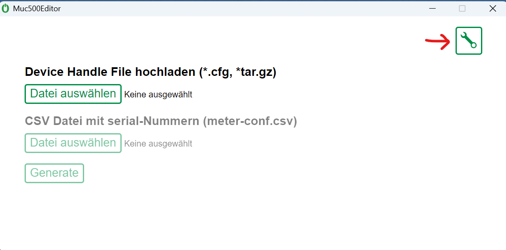
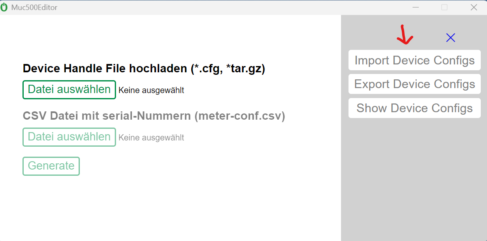
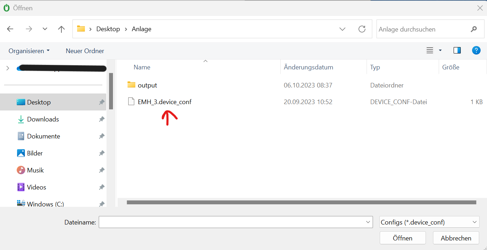
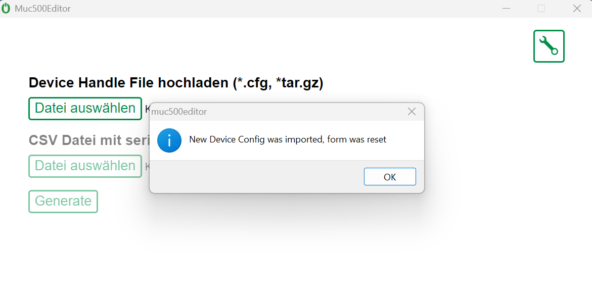
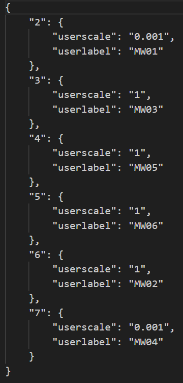
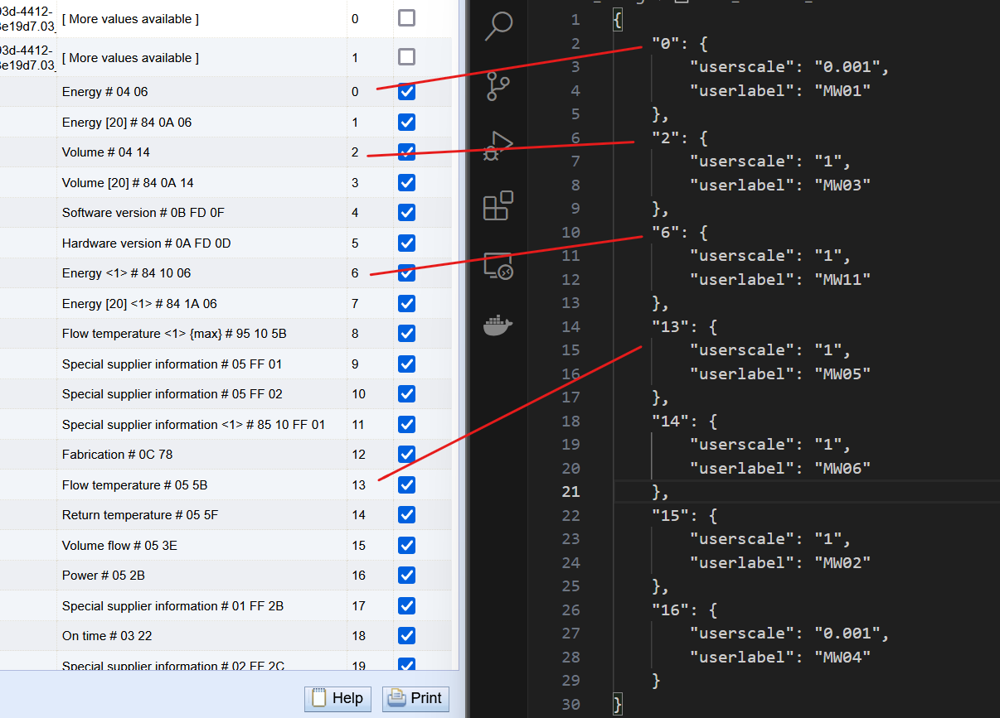

# muc500editor

The muc500editor is an app created with Electron JS. The goal for this app is to simplify a repetitive process of editing XML-Files containing configs for devices. These devices are often of the same type and therefore have the same configuration. Instead of editing these devices over and over again, the app makes use of Device Configs, JSON-Files, and applies these to the XML-File handed to the app.

## Table of contents

<!-- TABLE OF CONTENTS -->
  * [Installation](#installation)
  * [Usage](#usage)
    * [Device Config Import](#device-config-import)
    * [Device Config Export](*device-config-export)
    * [Show Device Configs](#show-device-configs)
    * [Device Config Format](#device-config-format)
    * [Upload Device Handle](#upload-device-handle)
    * [Upload Meter Conf](#upload-meter-conf)
    * [Meter Conf Format](#meter-conf-format)

<!-- INSTALLATION -->
## Installation

## Usage

### Device Config Import
When uploading one or multiplie device configs, it's important to make sure that the format is correct. The format can be found under [Device Config Format](#device-config-format).

<p>Open settings</p>

<p></p>
<p>Click 'Import Device Configs'</p>

<p></p>
<p>Select Device Config</p>

<p></p>
<p>Popup if import was succcessful</p>


<p align="right">(<a href="#muc500editor">back to top</a>)</p>

### Device Config Export


<p align="right">(<a href="#muc500editor">back to top</a>)</p>

### Show Device Configs


<p align="right">(<a href="#muc500editor">back to top</a>)</p>

### Device Config Format
The Device Configs are saved in a JSON-Format. The **filename** is a combination of the short form of the manufacturer, like **SON** and the version number like **25** -> **SON_25.device_conf**



One device can contain multiple measurement definitions. The structure of one measurement looks like this:
```js
"index": {
    "userscale": number,
    "userlabel": text
}
```

- index: The index in the Device Config is the same as the one in the Solvimus (See image below)
- userscale: With which scale should the data be uploaded
- userlabel: The label of the measurement e.g. 'MW01'


<p align="right">(<a href="#muc500editor">back to top</a>)</p>

### Upload Device Handle


<p align="right">(<a href="#muc500editor">back to top</a>)</p>

### Upload Meter Conf


<p align="right">(<a href="#muc500editor">back to top</a>)</p>

### Meter Conf Format


<p align="right">(<a href="#muc500editor">back to top</a>)</p>
